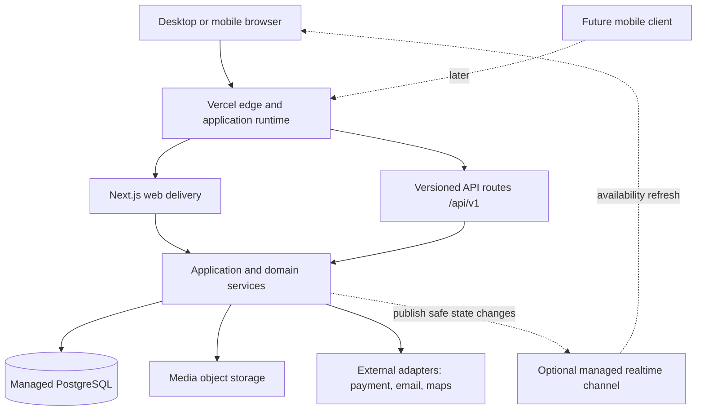
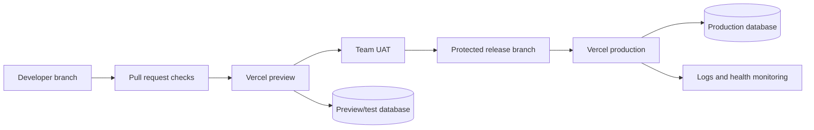
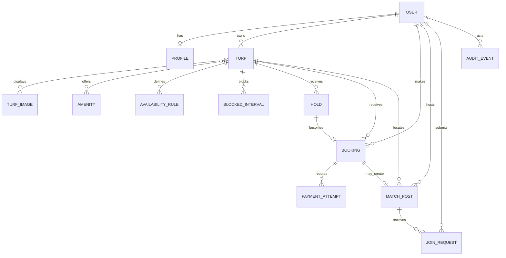
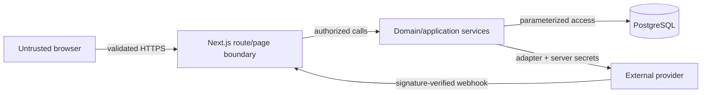

# Sportzfy Architecture and Design Specification

**Document ID:** SPZ-ADS-001  
**Version:** 0.1  
**Status:** Proposed architecture baseline  
**Prepared:** 3 September 2026  
**Related requirements:** `02-software-requirements-specification.md`

## 1. Purpose and authority

This document defines the target architecture for the Sportzfy web MVP and supersedes conflicting technical statements in earlier proposal material. It describes a system to be implemented; it does not claim that the components already exist.

## 2. Architectural drivers

The architecture is driven by:

- A responsive Next.js website deployed to Vercel before a native mobile client.
- Server-enforced player, turf-owner, and administrator permissions.
- Strong booking integrity under concurrent requests.
- A database-backed system that can be demonstrated reliably.
- Versioned resource APIs that a later mobile application can consume.
- External-service adapters so payment, media, email, and live updates can change without rewriting booking rules.
- A three-person academic team and limited delivery time.

## 3. Selected architectural style

Sportzfy will use a **modular monolith** with a layered internal design:

1. Next.js routes and server-rendered pages provide the web delivery layer.
2. Route handlers provide a versioned HTTP API.
3. Application services coordinate use cases and transactions.
4. Domain modules own booking, turf, match, and authorization rules.
5. Repositories isolate PostgreSQL persistence.
6. Adapters isolate payment, media, email, and optional real-time providers.

This style keeps deployment and cross-module transactions simple while maintaining boundaries that support a future mobile client and later service extraction.

## 4. High-level architecture



PostgreSQL remains the source of truth. A real-time channel may improve freshness, but it never decides whether a booking succeeds.

## 5. Deployment topology



Preview and production must use different databases and secrets. Production migrations run through a controlled release step rather than automatically from an arbitrary browser request.

## 6. Technology baseline

| Concern | Baseline | Rationale |
|---|---|---|
| Web framework | Next.js App Router with TypeScript | Supports server-rendered pages, route handlers, and one deployable application |
| Hosting | Vercel | Confirmed delivery target and preview workflow |
| Database | Managed PostgreSQL | Transactions, constraints, relational reporting, and future mobile compatibility |
| Data access | Prisma or an equivalent typed ORM with migrations | Explicit schema evolution and parameterized data access |
| Authentication | Established session/auth library integrated server-side | Avoids inventing password/session security |
| Validation | Shared schema validation at API boundaries | Consistent browser/server validation without trusting the browser |
| Styling | Token-based responsive CSS approach selected in Phase 2 | Supports consistent web UI without coupling domain logic to styling |
| Testing | Unit/component runner, Testing Library, Playwright | Covers domain, UI behavior, and critical browser journeys |
| CI/CD | Pull-request checks plus Vercel preview/production | Creates reviewable release evidence |

Exact packages and supported versions will be pinned in `sportzfy-web/package.json` during scaffolding.

## 7. Module boundaries

| Module | Responsibilities | Must not own |
|---|---|---|
| Identity | Sessions, user profile, role/status checks | Turf ownership and booking policy |
| Turfs | Listings, ownership, approval status, formats, amenities, media | Payment confirmation |
| Availability | Schedule rules, blocked intervals, slot queries | User authentication implementation |
| Bookings | Holds, price snapshots, confirmation, cancellation lifecycle | Provider-specific payment protocol |
| Payments | Payment attempts, idempotency, provider adapter | Deciding turf availability |
| Matchmaking | Match posts, roles/spots, join requests | Private messaging or payment splitting in MVP |
| Administration | Review actions and authorized oversight | Direct database mutation outside services |
| Audit | Security/business events and actor context | General debugging payload dumps |

Cross-module use cases are coordinated by application services, not by UI components calling repositories directly.

## 8. Suggested source structure

```text
sportzfy-web/
  app/
    (public)/
    (auth)/
    (player)/
    owner/
    admin/
    api/v1/
  components/
    ui/
    turf/
    booking/
    match/
  modules/
    identity/
    turfs/
    availability/
    bookings/
    payments/
    matchmaking/
    administration/
    audit/
  lib/
    auth/
    db/
    env/
    errors/
    validation/
  prisma/
    schema.prisma
    migrations/
    seed.ts
  tests/
    unit/
    integration/
    e2e/
```

Imports should flow from delivery to application/domain to infrastructure abstractions. Domain code must not import React components.

## 9. Domain model

### 9.1 Core entities

| Entity | Purpose | Important invariants |
|---|---|---|
| User | Identity and account status | One stable identifier; role/status enforced server-side |
| Profile | Public/minimized user attributes | Contact data not public by default |
| Turf | Venue owned by a user | Only approved and active turfs are publicly bookable |
| TurfImage | Ordered media reference | Owner can mutate only images for owned turf |
| Amenity | Normalized amenity option | Public labels controlled consistently |
| AvailabilityRule | Recurring open hours and pricing | Valid local time range and timezone |
| BlockedInterval | Owner/admin closure or walk-in allocation | Cannot silently overwrite confirmed booking |
| Hold | Temporary booking claim | Unique active claim for a turf/time interval; server expiry |
| Booking | Confirmed/cancelled reservation | Immutable price/time snapshot after confirmation |
| PaymentAttempt | Provider-neutral transaction record | Idempotency key and provider reference unique where present |
| MatchPost | Open game/recruitment listing | Non-negative open spots; public fields only |
| JoinRequest | Player request to join a match | One active request per player/post |
| TurfReview | Post-use rating/comment, if implemented | One eligible review per completed booking |
| AuditEvent | Security/business event | Append-oriented and actor/action scoped |

### 9.2 Entity relationships



### 9.3 Status models

- **Turf:** `DRAFT -> PENDING_REVIEW -> APPROVED | REJECTED -> INACTIVE`
- **Hold:** `ACTIVE -> CONSUMED | EXPIRED | RELEASED`
- **Booking:** `PENDING_PAYMENT -> CONFIRMED -> COMPLETED | CANCELLED`; failed/expired checkout ends without a confirmed booking.
- **Payment attempt:** `CREATED -> PENDING -> SUCCEEDED | FAILED | CANCELLED`; refunds are separate records when implemented.
- **Match post:** `OPEN -> FULL | CLOSED | CANCELLED | COMPLETED`
- **Join request:** `PENDING -> ACCEPTED | REJECTED | WITHDRAWN`

Invalid transitions are rejected by application services even when a user constructs a direct API request.

## 10. Booking integrity design

### 10.1 Hold acquisition

1. Authenticate the player.
2. Validate turf is approved/active and requested interval derives from bookable availability.
3. Start a database transaction.
4. Remove or ignore expired holds according to transaction-safe rules.
5. Check for overlapping active hold, confirmed booking, or blocked interval.
6. Insert the hold with server-calculated price snapshot and expiry.
7. Commit and return the hold plus server expiry.

The final database schema must enforce the strongest practical collision guarantee. A query-only pre-check is insufficient because two requests can pass it simultaneously.

### 10.2 Confirmation

1. Receive an authenticated request with an idempotency key.
2. Load and lock the hold/booking state in a transaction.
3. Verify ownership, expiry, amount, and payment-provider status.
4. If already confirmed for the same idempotency key, return the existing result.
5. Create or transition the booking and consume the hold atomically.
6. Persist an audit event and commit.

### 10.3 Failure behavior

- A losing concurrent request receives `409 Conflict` with a stable error code.
- An expired hold receives `410 Gone` and a recovery link to refresh availability.
- A repeated successful confirmation returns the existing booking.
- A provider outage keeps state pending or fails explicitly; it never invents payment success.

## 11. API style and conventions

### 11.1 General rules

- REST-style resources under `/api/v1`.
- Plural nouns for collections.
- `GET` for safe reads, `POST` for creation/commands that create resources, `PATCH` for partial updates, and `DELETE` only where deletion is truly supported.
- JSON request and response bodies unless a media-upload adapter requires a signed upload flow.
- ISO 8601 timestamps with explicit timezone/UTC; display conversion happens at the boundary.
- Cursor pagination for unbounded feeds; bounded page size for administrative lists.
- Server-side filtering allowlist; unknown filter fields are rejected.
- Idempotency keys on booking/payment confirmation mutations.

### 11.2 Response envelope

Single resource:

```json
{
  "data": {
    "id": "trf_123",
    "name": "Sample Turf"
  }
}
```

Collection:

```json
{
  "data": [],
  "page": {
    "nextCursor": null,
    "hasMore": false
  }
}
```

Error:

```json
{
  "error": {
    "code": "SLOT_CONFLICT",
    "message": "That slot is no longer available.",
    "fieldErrors": {},
    "requestId": "req_123"
  }
}
```

Error messages are safe for users; detailed causes remain in redacted server logs.

### 11.3 Core endpoints

| Method | Path | Actor | Purpose |
|---|---|---|---|
| GET | `/api/v1/turfs` | Public | List approved turfs with search/filter/pagination |
| GET | `/api/v1/turfs/{turfId}` | Public | Get approved turf details |
| GET | `/api/v1/turfs/{turfId}/availability` | Public | Get availability for a bounded date range |
| POST | `/api/v1/holds` | Player | Atomically hold a slot |
| GET | `/api/v1/holds/{holdId}` | Hold owner | Inspect hold and expiry |
| DELETE | `/api/v1/holds/{holdId}` | Hold owner | Voluntarily release active hold |
| POST | `/api/v1/bookings` | Player | Confirm a held booking idempotently |
| GET | `/api/v1/bookings` | Authenticated | List bookings visible to current actor |
| GET | `/api/v1/bookings/{bookingId}` | Authorized actor | Get booking detail |
| POST | `/api/v1/bookings/{bookingId}/cancellations` | Booking owner/admin | Request/record cancellation |
| POST | `/api/v1/payment-attempts` | Hold owner | Start mock/sandbox payment attempt |
| POST | `/api/v1/payment-webhooks/{provider}` | Provider | Receive verified provider event |
| POST | `/api/v1/owner/turfs` | Owner | Create draft turf |
| PATCH | `/api/v1/owner/turfs/{turfId}` | Turf owner | Update owned turf |
| POST | `/api/v1/owner/turfs/{turfId}/submissions` | Turf owner | Submit listing for review |
| PUT | `/api/v1/owner/turfs/{turfId}/availability-rules` | Turf owner | Replace validated recurring schedule |
| POST | `/api/v1/owner/turfs/{turfId}/blocked-intervals` | Turf owner | Block interval or record walk-in |
| GET | `/api/v1/admin/turf-submissions` | Admin | List pending submissions |
| POST | `/api/v1/admin/turf-submissions/{submissionId}/decisions` | Admin | Approve/reject with reason |
| GET | `/api/v1/match-posts` | Public | Browse active match posts |
| POST | `/api/v1/match-posts` | Player | Create a match post |
| PATCH | `/api/v1/match-posts/{postId}` | Post owner | Update/close own post |
| POST | `/api/v1/match-posts/{postId}/join-requests` | Player | Request to join |
| POST | `/api/v1/join-requests/{requestId}/decisions` | Post owner | Accept/reject request |

Authentication endpoints follow the selected authentication library's safe server integration and are documented separately if their public contract is exposed.

### 11.4 HTTP outcomes

| Status | Use |
|---:|---|
| 200 | Successful read, update, or idempotent replay |
| 201 | Resource created |
| 204 | Successful response with no body |
| 400 | Malformed request or unsupported filter |
| 401 | Authentication required/invalid |
| 403 | Authenticated but unauthorized |
| 404 | Resource not found or intentionally hidden |
| 409 | State or booking conflict |
| 410 | Hold/resource expired and no longer actionable |
| 422 | Semantically invalid fields/business input |
| 429 | Rate limit exceeded |
| 500 | Unexpected server error with safe response |
| 503 | Required dependency temporarily unavailable |

## 12. Authentication and authorization

- The server resolves the current actor from a signed, secure session.
- UI visibility is convenience only; every protected route and mutation repeats authorization server-side.
- Turf ownership is checked from persistent data, not a client-provided owner ID.
- Administrative actions require an active administrator role and create audit events.
- Sensitive changes may require recent authentication if supported by the chosen auth system.
- Session cookies use secure production settings and an appropriate same-site policy.

Authorization matrix:

| Resource/action | Public | Player | Owner | Admin |
|---|---:|---:|---:|---:|
| Browse approved turfs/matches | Yes | Yes | Yes | Yes |
| Hold/book a slot | No | Yes | Yes as player | Yes as authorized support only |
| Manage own booking/profile | No | Own | Own | Authorized oversight |
| Manage turf/schedule | No | No | Owned turf | Authorized oversight |
| Approve turf | No | No | No | Yes |
| Join match | No | Yes | Yes as player | Yes as player if allowed |

## 13. External adapters

### 13.1 Payment

```text
PaymentProvider
  createAttempt(input) -> provider session/reference
  verifyReturn(input) -> verified status
  processWebhook(headers, body) -> verified event
  getStatus(reference) -> normalized status
```

The default assessed provider is a clearly labeled mock until an official sandbox is approved. Provider payloads remain inside the adapter; application services use normalized statuses.

### 13.2 Media

The media adapter will create signed uploads or accept approved seeded assets, validate content type/size, and store only references in PostgreSQL. User-supplied filenames are not trusted as storage paths.

### 13.3 Live availability

The MVP may use bounded polling/revalidation. If managed real-time events are added, events contain only identifiers and safe state summaries. Clients always re-fetch authoritative state before booking.

## 14. Caching and consistency

- Public turf lists/details may be cached with explicit invalidation after approval or owner changes.
- Personalized booking, hold, owner, and admin responses are not placed in public caches.
- Availability caches are short-lived and never used as confirmation authority.
- Database writes that affect booking availability invalidate or version relevant reads.

## 15. Validation and error handling

- Parse and validate all path, query, body, header, and webhook inputs at trust boundaries.
- Use stable machine-readable error codes and user-safe messages.
- Convert expected domain errors to intentional 4xx responses.
- Attach a request/correlation ID to unexpected errors.
- Never return database internals, stack traces, tokens, or provider secrets.
- UI error states preserve safe input and offer the next valid action.

## 16. Observability and audit

Minimum operational signals:

- Request ID, route, status, duration, and actor ID where appropriate.
- Booking hold/confirm/cancel transitions without sensitive provider payloads.
- Turf submission/approval transitions.
- Authentication failures as aggregated security signals.
- Health check for application and database reachability.
- Deployment/release identifier in logs.

Audit events include actor, action, resource type/ID, result, timestamp, and safe metadata. They are not editable through ordinary product APIs.

## 17. CI/CD design

Pull-request gate:

1. Dependency installation from lockfile.
2. Formatting check.
3. Lint.
4. Type check.
5. Unit/component tests.
6. Integration tests where the CI database is available.
7. Production build.
8. Preview deployment and selected Playwright smoke tests.

Production gate:

1. Approved merge/tag.
2. Backup/rollback consideration for schema changes.
3. Controlled migration.
4. Production deployment.
5. Health and critical smoke checks.
6. Evidence capture and release note.

## 18. Security boundaries



Trust boundaries exist at every browser request, webhook, upload, database record, and external response. Authentication does not make input trusted.

## 19. Architecture decisions

| Decision | Choice | Consequence |
|---|---|---|
| Client delivery | Web first, mobile later | Responsive behavior and mobile-compatible APIs are mandatory |
| System shape | Modular monolith | Simple deployment/transactions; module boundaries require discipline |
| Data authority | PostgreSQL | Strong integrity; migrations and relational design are required |
| Slot integrity | Database transaction/constraint | Correctness does not depend on browser timers or realtime delivery |
| Vercel compatibility | No self-hosted long-lived WebSocket dependency in MVP | Use bounded refresh or managed realtime adapter |
| Payments | Provider adapter with mock first | Demonstrable flow without falsely claiming production processing |
| API | Versioned resource-oriented REST | Predictable later mobile integration; contract must be documented/tested |

Decisions that materially change these choices should receive a separate ADR during Phase 2 or implementation.

## 20. Open design decisions

- [ ] ORM and managed PostgreSQL provider.
- [ ] Authentication library and account-recovery scope.
- [ ] Hold duration and cleanup mechanism.
- [ ] Exact overlap constraint strategy for PostgreSQL.
- [ ] Media-storage provider and upload limits.
- [ ] Polling/revalidation versus managed realtime events.
- [ ] Mock payment only versus official bKash/Nagad sandbox.
- [ ] Retention period for audit events and personal data.
- [ ] Review eligibility and moderation if turf reviews enter the MVP.

## 21. Architecture acceptance gate

Before implementation begins, the team must approve:

1. Module boundaries and deployment shape.
2. ER model and status transitions.
3. Booking collision/transaction approach.
4. API conventions and critical endpoints.
5. Authorization matrix.
6. External-service fallbacks.
7. CI/CD and release evidence requirements.

