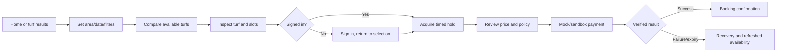
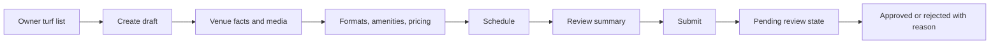

# Sportzfy UI/UX Specification

**Document ID:** SPZ-UX-001  
**Version:** 0.1  
**Status:** Behavioral and information-architecture baseline  
**Prepared:** 3 September 2026  
**Platform:** Responsive website, mobile web first  
**Detailed visual direction:** Deferred to Phase 2

## 1. Purpose

This specification defines who uses each Sportzfy surface, what they must accomplish, how screens connect, what states must exist, and how the experience adapts across devices. It deliberately does not lock colors, typography, or decorative styling before the Phase 2 visual-direction decision.

The Playo listing is a category and capability reference. Sportzfy must not copy its brand, text, proprietary assets, or screen composition.

## 2. Experience principles

1. **Availability first:** show credible date/time availability early instead of making users open multiple pages.
2. **One obvious next action:** each booking step clearly communicates what is selected, what is missing, and what happens next.
3. **Trust through specifics:** display price components, hold expiry, cancellation summary, and data status rather than generic reassurance.
4. **Mobile coordination:** optimize for players checking slots and sharing plans from a phone.
5. **One source of truth:** player and owner interfaces describe the same booking state with role-appropriate actions.
6. **Recoverable flows:** expired holds, stale availability, failed payments, validation errors, and connection loss always offer a safe next step.
7. **Honest demonstration:** sample venues, payments, ratings, and analytics are visibly labeled until they are real.

## 3. Audience, jobs, and visitor modes

| Surface | Audience and situation | Primary job | Mode |
|---|---|---|---|
| Public home | First-time visitor comparing Sportzfy with calls/social groups | Understand the service and start searching | Persuade |
| Turf discovery/details | Player planning a match, often under time pressure | Find a suitable, available turf | Operate |
| Checkout/booking | Player ready to reserve | Secure the correct slot and understand cost/policy | Operate |
| My bookings | Returning player coordinating upcoming games | Verify status and manage own booking | Operate |
| Open matches | Solo player or captain missing participants | Find or fill a game | Operate |
| Owner workspace | Owner managing inventory between calls/walk-ins | Keep availability accurate and process bookings | Operate |
| Admin workspace | Authorized reviewer/support user | Review listings and inspect exceptions | Operate |

## 4. Information architecture

```text
Public
  Home
  Explore turfs
    Turf details
      Availability
  Open matches
    Match details
  Sign in
  Create account

Player
  Explore
  Turf details
  Hold and checkout
  Booking confirmation
  My bookings
    Booking details
  Open matches
    Create match post
    Join request
  Profile

Owner
  Overview
  My turfs
    Create/edit turf
    Availability and pricing
    Block slot / walk-in booking
  Bookings
  Profile

Admin
  Overview
  Turf review queue
    Submission review
  Users
  Bookings
  Audit/review details
```

## 5. Proposed route map

| Route | Access | Purpose |
|---|---|---|
| `/` | Public | Product explanation plus immediate discovery entry |
| `/turfs` | Public | Searchable/filterable approved turf results |
| `/turfs/[turfId]` | Public | Turf detail and availability |
| `/matches` | Public | Browse active open matches |
| `/matches/[postId]` | Public/sign-in to join | Match detail and join action |
| `/sign-in` | Signed-out | Authentication |
| `/sign-up` | Signed-out | Player account creation |
| `/checkout/[holdId]` | Hold owner | Review and confirm held slot |
| `/bookings` | Player | Current user's booking list |
| `/bookings/[bookingId]` | Authorized | Booking status/detail |
| `/matches/new` | Player | Create open-match post |
| `/profile` | Authenticated | Personal profile/account controls |
| `/owner` | Owner | Owner overview |
| `/owner/turfs` | Owner | Owned turf list |
| `/owner/turfs/new` | Owner | Draft listing form |
| `/owner/turfs/[turfId]` | Turf owner | Edit listing |
| `/owner/turfs/[turfId]/schedule` | Turf owner | Availability/pricing calendar |
| `/owner/bookings` | Owner | Booking operations |
| `/admin` | Admin | Administrative overview |
| `/admin/turf-submissions` | Admin | Review queue |
| `/admin/turf-submissions/[submissionId]` | Admin | Approve/reject listing |

Unauthorized routes either redirect to sign-in with a safe return path or show an explicit forbidden state after authentication. The decision depends on whether authentication could legitimately resolve access.

## 6. Navigation model

### 6.1 Public and player navigation

- Desktop: persistent top navigation with Sportzfy identity, Explore, Open Matches, booking/account entry, and one dominant contextual action.
- Mobile: compact header plus bottom navigation for high-frequency authenticated destinations: Explore, Matches, Bookings, Profile.
- Checkout and focused forms reduce navigation distractions but preserve a safe exit and selected-booking summary.
- Browser Back must return users to their preserved turf search/filter context when practical.

### 6.2 Owner navigation

- Desktop: sidebar or stable workspace navigation for Overview, Turfs, Bookings, and Profile.
- Mobile: compact workspace navigation that never relies on hover and keeps the current turf/context visible.
- Switching between player and owner contexts must be explicit; permissions never change merely because a tab is displayed.

### 6.3 Administrator navigation

- Separate administrative shell with clear role identity.
- Review queue and exception work lead; vanity analytics do not displace pending decisions.
- Potentially consequential actions require a review step and record a reason.

## 7. Primary user journeys

### 7.1 Discover and book a turf



Success means the player can identify the booked turf, date, time, amount/status, and booking reference without relying on memory or a separate message.

### 7.2 Owner publishes a turf



### 7.3 Record a walk-in booking

Owner opens the schedule, selects a free interval, chooses **Walk-in booking**, enters the minimum reference, reviews the collision warning, and confirms. The public availability refreshes from the same stored booking truth.

### 7.4 Recruit or join a match

Captain creates a post with date/time, place, format, required roles, spots, and cost-share text. A player browses, inspects requirements, signs in, and requests to join. The captain accepts or rejects. Full posts stop accepting requests.

## 8. Screen specifications

### 8.1 Public home

**Job:** explain the mechanism and start discovery within the first viewport.

Required content:

- Sportzfy identity and concise value proposition grounded in local turf booking.
- Search entry using area, date, and time as the primary interaction.
- Evidence-backed problem/benefit explanation without invented user counts or partners.
- Small selection of clearly labeled sample/real approved turfs.
- Explanation of booking, owner participation, and open matches.
- Clear player and owner entry points.

The final first-viewport composition and signature interaction are Phase 2 decisions. It must demonstrate availability or discovery rather than show only a generic sports photograph.

### 8.2 Turf results

- Query/search field, date, time window, area, price, pitch format, amenities, and availability filters.
- Applied filters visible and individually removable.
- Result count and sort control with an honest default.
- Result items show decision-making facts consistently.
- Mobile filters open in a full-height sheet or equivalent with Apply and Reset.
- Empty state explains which filters caused the restriction and offers targeted recovery.

Typical range: 0-30 loaded results; pagination or load-more beyond the bound. Turf names should support approximately 10-60 characters without breaking layout.

### 8.3 Turf detail and availability

- Image gallery with meaningful alt text when images convey venue information.
- Name, area/location text, formats, amenities, description, and pricing.
- Listing status/trust cues based only on real verification state.
- Date selector and clear availability legend.
- Slots communicate available, held, booked, blocked, selected, and unavailable states without color alone.
- Sticky or consistently reachable booking summary/action on small screens.
- Stale availability refresh keeps the user's selected date when safe.

### 8.4 Hold and checkout

- Persistent order summary: venue, date, time, duration, price lines, total.
- Server-synchronized hold expiry with text and progress, not color alone.
- Plain-language cancellation/refund summary.
- Payment method marked **Demo** or **Sandbox** where applicable.
- Confirmation action disabled only with an adjacent explanation.
- On expiry, prevent confirmation and offer **Check availability again**.
- On repeated submission, show the existing booking instead of a duplicate success.

### 8.5 Booking confirmation and history

- Confirmation shows status, reference, venue, time, amount/payment mode, and next actions.
- History groups upcoming and past/cancelled items while preserving exact statuses.
- Booking detail provides cancellation action only when permitted.
- Empty state returns the player to turf discovery.
- No QR code is shown unless verification is actually implemented.

### 8.6 Open matches

- Feed filters: date, area, role, format, and open spots.
- Post card/detail: host display name, time, place, skill guidance, requested roles, available spots, and cost-share text.
- Private contact data remains hidden.
- Duplicate join requests are prevented with a visible current status.
- Captain view separates pending and accepted requests and makes capacity visible.

### 8.7 Owner overview

- Pending operational items first: review status, upcoming bookings, schedule gaps/conflicts.
- Summary metrics state time range and whether amounts are demo/sandbox.
- Clear paths to edit turf, manage schedule, block interval, and view bookings.
- New owners see an onboarding checklist rather than empty charts.

### 8.8 Turf editor and schedule

- Multi-section form with a persistent completion/status summary.
- Draft saving where feasible; unsaved-change warning on destructive navigation.
- Schedule view supports keyboard and touch selection.
- Booking, hold, block, and open states use labels/patterns/icons in addition to color.
- Conflicting changes explain the affected interval and preserve unrelated edits.

### 8.9 Administrator review

- Queue shows submission age, owner, turf, completeness, and status.
- Review compares submitted facts and media without exposing unrelated personal data.
- Approve/reject requires a clear decision; rejection requires a reason.
- Success returns to the queue with the action and audit reference visible.

## 9. Interaction states

Every data-driven surface must define:

| State | Required behavior |
|---|---|
| Loading | Preserve page structure; describe meaningful loading status to assistive technology |
| Empty | Explain why content is absent and provide the next valid action |
| Validation error | Associate message with field, preserve safe input, focus/announce summary on submit |
| Authorization failure | Explain access level without exposing protected resource details |
| Network/server error | State that the action did not complete and offer safe retry/navigation |
| Conflict/stale data | Show changed state, preserve context, and require fresh confirmation |
| Hold expiring | Display server-based remaining time and consequences |
| Hold expired | Disable confirmation and refresh availability |
| Payment pending | Avoid success language; offer status refresh or return path |
| Success | Name the completed action and show its persistent reference/state |

Optimistic updates are allowed only where rollback is unambiguous. Booking confirmation is never optimistic.

## 10. Responsive behavior

- Start from 320-430px mobile browser layouts, then expand to tablet and desktop.
- Critical actions remain reachable with the on-screen keyboard open.
- Tables transform into labeled records or allow intentional local scrolling; the page itself must not overflow horizontally.
- Cards are used only when they improve grouping, not as a default container for every element.
- Desktop space supports side-by-side comparison and owner operations; it must not merely stretch mobile cards.
- Hover may enhance but never reveal required content or actions.
- Touch targets, sticky elements, and safe-area spacing must be tested on representative mobile browsers.

Primary verification widths: 320, 390, 768, 1024, and 1440 CSS pixels, plus the user's actual viewport if provided.

## 11. Accessibility requirements

- Semantic landmarks and logical heading order.
- Keyboard navigation for search, filters, calendars, dialogs, menus, and forms.
- Visible focus not obscured by sticky headers/footers.
- Accessible names for icon-only controls.
- Text alternatives for informative venue images; decorative images ignored appropriately.
- Status changes announced without stealing focus unnecessarily.
- Error summary plus field-level messages for long forms.
- Sufficient text/background and state contrast; color never the sole signal.
- Reduced-motion preference respected.
- Auth, booking, owner scheduling, and admin review tested with keyboard and at least one screen-reader/browser combination before release.

## 12. Content and localization

- Initial interface language: English, with language kept concise and culturally appropriate for Bangladesh.
- Store timestamps unambiguously and display initial user-facing time in Asia/Dhaka.
- Display Bangladeshi Taka as `৳` plus a consistently formatted amount.
- Support long venue names, areas, role labels, and translated expansion without truncating essential meaning.
- Avoid claims such as “verified,” “real-time,” “refunded,” or “paid” unless the underlying state supports them.
- Identify seeded/demo content close to where it could be mistaken for production data.

## 13. Reusable interaction components

Phase 2 should design reusable primitives for:

- Search and filter controls.
- Date and time-slot selection.
- Status badges/legends.
- Turf result and booking summary records.
- Price breakdown.
- Timed hold notice.
- Empty/error/loading states.
- Confirmation and destructive-action dialogs.
- Form fields and validation summary.
- Workspace navigation.
- Audit/decision record.

Components inherit a single visual system after the direction is approved; player, owner, and admin areas should not look like unrelated templates.

## 14. Behavioral design brief for Phase 2

- **Job and audience:** help Bangladesh-based players find a trustworthy available turf quickly, while enabling owners to keep the same inventory accurate.
- **Outcome and proof:** the primary proof is visible, specific availability and a booking state that survives refresh; success is a confirmed reference without coordination calls.
- **Scope:** responsive public discovery plus player, owner, and admin operation flows defined in this document.
- **Memorable product moment:** availability changes from selectable to briefly held to confirmed with transparent time, price, and state—not merely a decorative sports motif.
- **Constraints:** mobile web first, Vercel delivery, accessible interactions, honest demo data, future mobile-client compatibility, and no visual copying of Playo.

## 15. Visual direction status

There is no approved durable visual authority yet. The green styling in the Expo prototype is evidence of the subject, not a binding web identity. Phase 2 must choose the Sportzfy visual world and first-surface composition before UI implementation. Until then:

- Do not create `DESIGN.md` from intention alone.
- Do not treat the Expo theme as approved web tokens.
- Do not hard-code a detailed palette, font family, radius system, or motion grammar into this specification.
- Preserve the product truth, route hierarchy, states, and accessibility requirements defined here.

## 16. UX acceptance gate

Before implementation, the team should confirm:

1. Route map and role navigation.
2. Booking, owner, admin, and matchmaking journeys.
3. Required states and recovery behavior.
4. Responsive priorities and accessibility target.
5. Content/data ranges and demo labeling.
6. The Phase 2 visual-direction process and build path.

This draft assumes the agreed MVP is a production-oriented academic demonstration rather than a static visual prototype. Corrections should be made before detailed wireframes or code.

